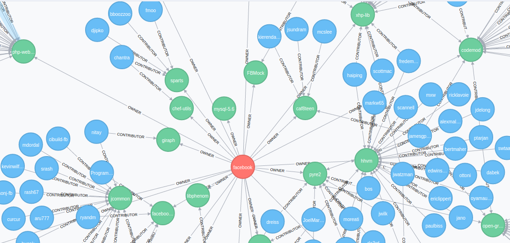

# social-software-engineering

_Live demo link: [https://zachd.github.io/social-software-engineering/](https://zachd.github.io/social-software-engineering/)_

Social Software Engineering project for CS7009 '17. This project crawls from a specified User or Organisation on GitHub, gets information about the associated repos, then crawls further to get the contributors to these repos. 

This proof-of-concept aims to answer the question "**Who is the most influential user in an organisation?**". Test results are shown for [Facebook](https://zachd.github.io/social-software-engineering/graph.html?org=facebook), [Airbnb](https://zachd.github.io/social-software-engineering/graph.html?org=airbnb) and [Netflix](https://zachd.github.io/social-software-engineering/graph.html?org=netflix) on the linked demo page. The most influential user can be inferred from the amount of relationships connecting them to other nodes.

A crawl is started by accessing the desired endpoint with an auth token, like `/user/<name>/<token>` or `/org/<name>/<token>`. Logs for crawling are shown in stdout. The crawler is limited to `25` results per Organisation/Repo/User for speed during large requests.

# Elements
### servant-crawler
Crawls GitHub for organisations, users and repos.
### yesod-web
Frontend for obtaining Github auth and viewing results.

# Requirements
 - Haskell (GHCI)
 - Neo4J

# Running
 - `cd yesod-web; stack build; stack exec yesod-web`
 - `cd servant-crawler; stack build; stack exec servant-crawler`
 - Visit `localhost:3000` for yesod-web
 - Visit `localhost:8080` for servant-crawler
